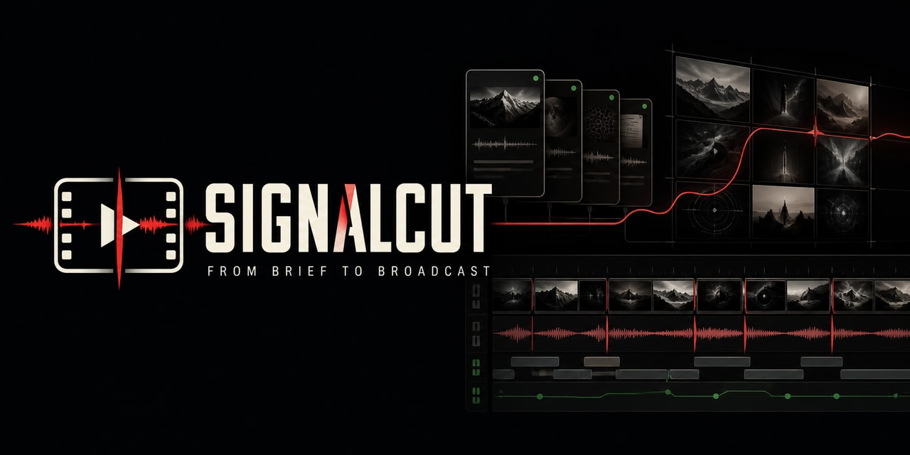
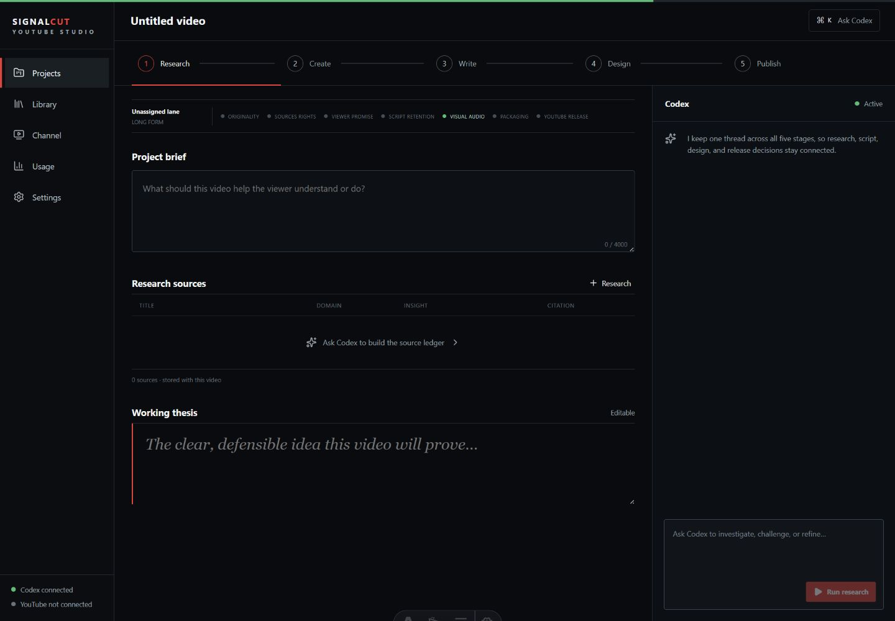

# SignalCut Installer

> Turn a YouTube brief into researched, written, designed, approval-ready faceless videos from one local Codex-powered studio.

See the SignalCut Studio workspace

This is the public installation and update-verification repository for SignalCut. It intentionally contains **no SignalCut application source code, credentials, signing secrets, or private-repository access**.

> **Release status:** the installer shell is ready, but public installation remains disabled until the first proprietary SignalCut binary is packaged, signed, and published with the production release public key. The installer fails closed while that key or release is absent.

## Install SignalCut

When the first signed application release is available:

1. Open the repository's [Releases](https://github.com/Devi8d0ne/signalcut-installer/releases) page.
2. Download the installer for your operating system and CPU architecture.
3. Confirm the operating-system signature, then run the installer.
4. Open SignalCut and connect your existing Codex installation and authenticated account.

Or clone this installer repository, open it in Codex Desktop, and use the reviewed [Codex installation prompt](CODEX_INSTALL_PROMPT.md). Codex follows the same signed-manifest and checksum verification path; it never receives SignalCut's private source or your service credentials.

The SignalCut package bundles its application runtime, FFmpeg/FFprobe, browser automation, local database runtime and migrations, base narration model, and updater. End users do not install Node.js, npm, Git, Wrangler, Python, or media tooling.

Codex Desktop itself is not bundled. A supported Codex installation and authenticated Codex account are required to use SignalCut. User-owned Google, YouTube, and other service credentials are connected locally after first launch.

## Optional Codex guidance

Codex can guide a user through choosing and validating an official release using [CODEX_INSTALL_PROMPT.md](CODEX_INSTALL_PROMPT.md). It must never clone SignalCut's private source, install development dependencies, replace the pinned release key, or collect application credentials.

## Updates

Every approved private R&D version produces a new immutable, signed GitHub Release here. SignalCut checks the signed release manifest and offers the compatible update. Application source never enters this repository.

See [updates and release channels](docs/updates.md) for the exact behavior.

## Maintainer verification code

The Node.js code in `src/` is a public reference implementation and security test for signed manifest selection. It is not the normal end-user installer and is not a SignalCut runtime dependency.

## What remains local

After SignalCut starts, connect your Codex session, Google OAuth client, YouTube authorization, and any other supported user-owned services inside SignalCut's local interface. Do not put those credentials in this repository or a Codex conversation.

SignalCut's working database, channel authorization, source ledger, scripts, narration, frames, thumbnails, renders, and usage ledger remain on the operator's machine. Local services bind to loopback addresses rather than becoming a hosted multi-user service.

## What SignalCut is built to do

- Maintain one durable Codex thread across research, creative development, writing, design, and release.
- Run owner-defined content lanes mapped to real YouTube playlists, categories, formats, and schedules.
- Research current sources, record citations and rights, and avoid generic filler footage.
- Produce scripts, chapters, captions, metadata, focused hashtags, thumbnails, narration, and production manifests.
- Use rights-cleared free media plus original locally rendered visual treatments and generated frames.
- Support selective reproduction of only the rejected voiceover, music, frames, cover, script, or metadata.
- Keep autonomous safe stages behind the selected approval policy and final YouTube publishing under owner control.
- Track exact Codex usage, model, reasoning effort, duration, and pipeline outcomes.

## Repository boundary

This repository is MIT-licensed installer infrastructure. SignalCut itself is proprietary and licensed separately under the EULA delivered with each release. Viewing or modifying this installer does not grant rights to SignalCut application source or binaries.

- [SignalCut EULA](SIGNALCUT-EULA.md)
- [Privacy disclosure](PRIVACY.md)
- [Setup and credential guidance](docs/setup.md)
- [Release hosting contract](docs/hosting.md)
- [Update behavior](docs/updates.md)
- [Troubleshooting](docs/troubleshooting.md)
- [Security policy](SECURITY.md)
